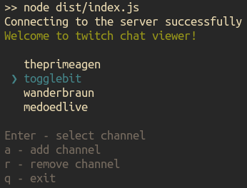
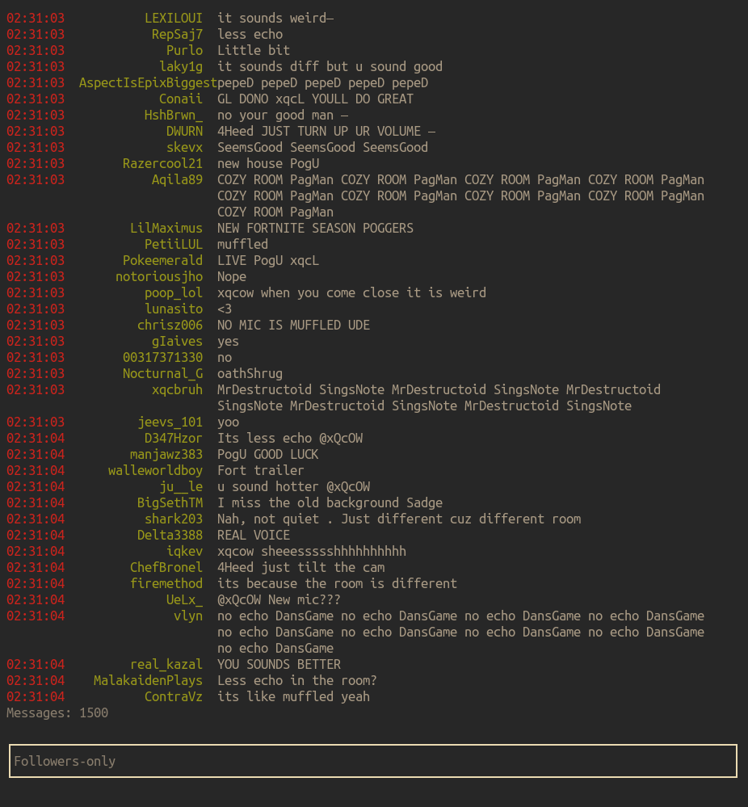
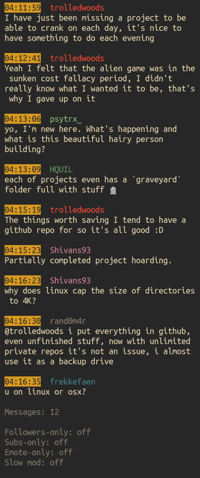

## CLI Twitch chat viewer

[](https://github.com/darteil/twitch-chat-viewer/blob/master/LICENSE.md)

### Screenshots

Start screen:



Chat:

| Default mode              |  Compact mode             |
|:-------------------------:|:-------------------------:|
|     |     |

### Usage

```bash
# Install dependencies
npm install

# Build
npm run build

# Start
node dist/index.js

# Create release ("release" folder)
npm run pack
```

### Configuration file
The user configuration is named as `.settings.json` and placed inside the folder `$HOME/.config/twitch-chat-viewer`

Default config:
``` jsonc
{
  "showMods": true,
  "moderatorIcon": "◉",
  "moderatorIconColor": "#ffffff"
}
```

## License

MIT License, Copyright (c) 2021 Romanov Yuri
