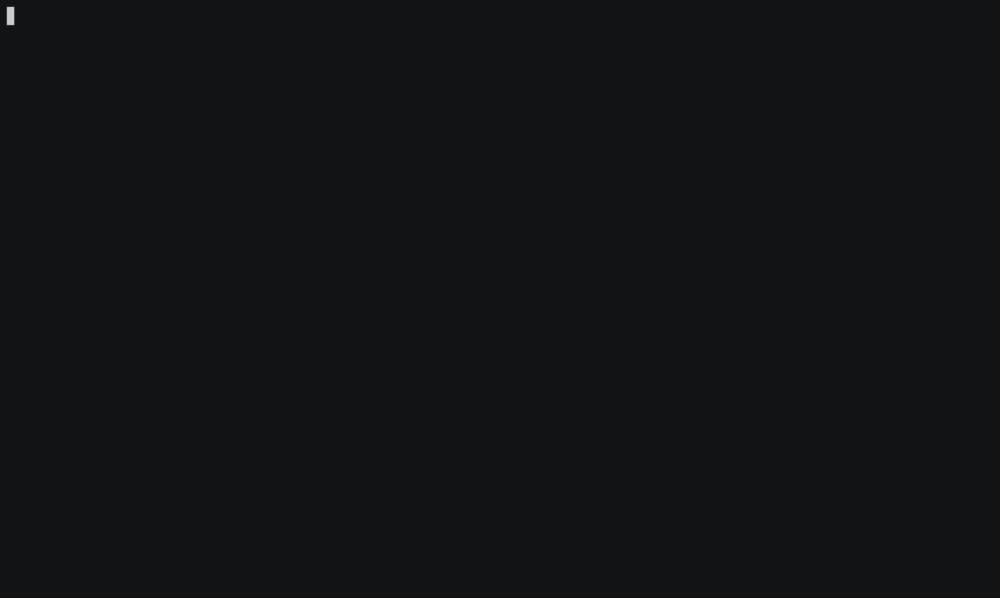

## Twitch chat viewer

[](https://github.com/darteil/twitch-chat-viewer/blob/master/LICENSE.md)



### Usage

```bash
# Install dependencies
npm install

# Build
npm run build

# Start
node dist/index.js -c channel_name

# Create release ("release" folder)
npm run pack
```

## License

MIT License, Copyright (c) 2021 Romanov Yuri
